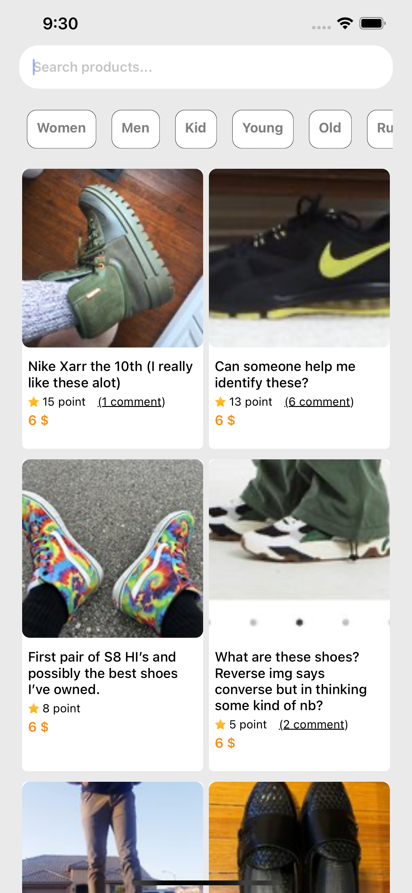
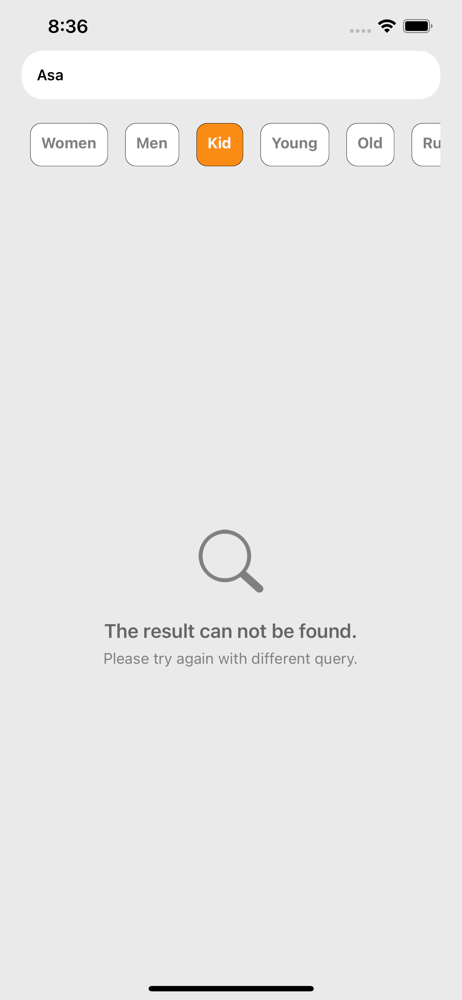
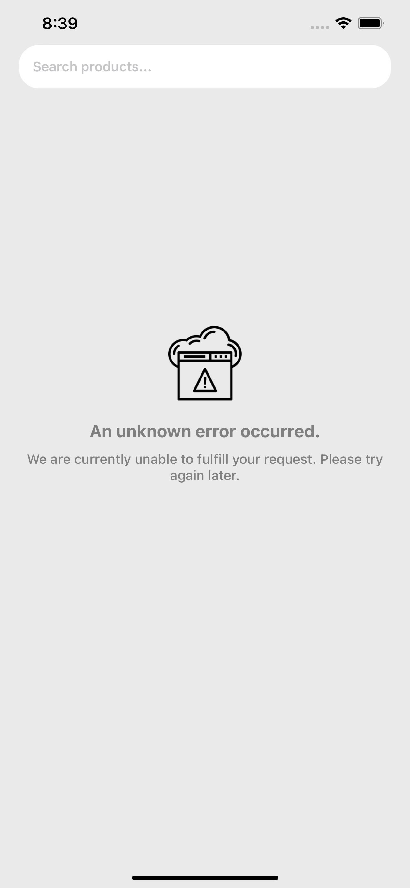
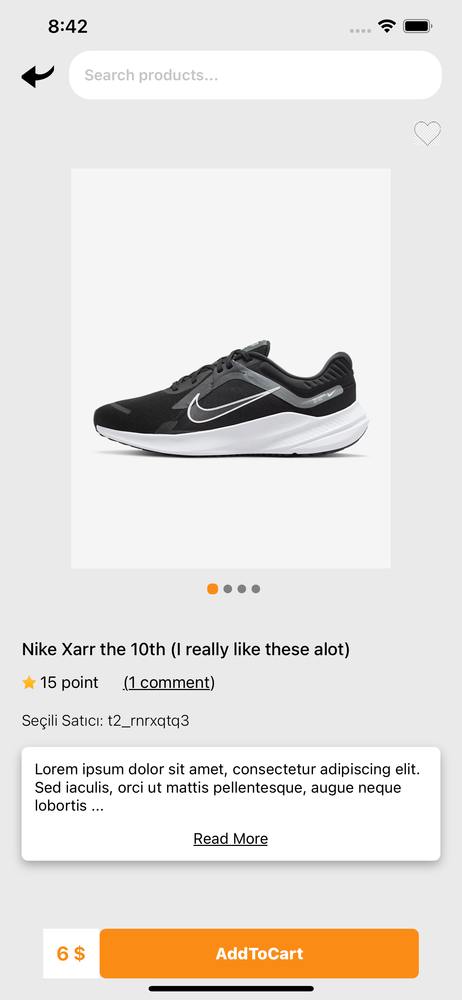
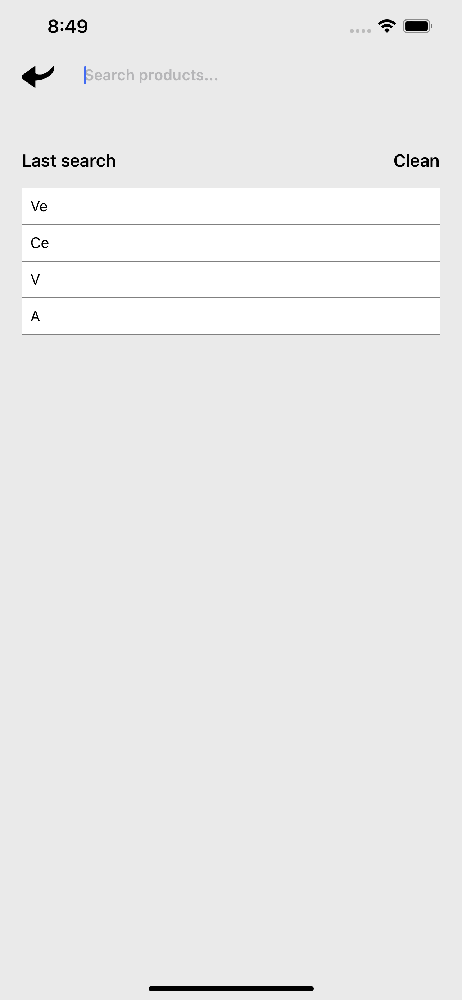
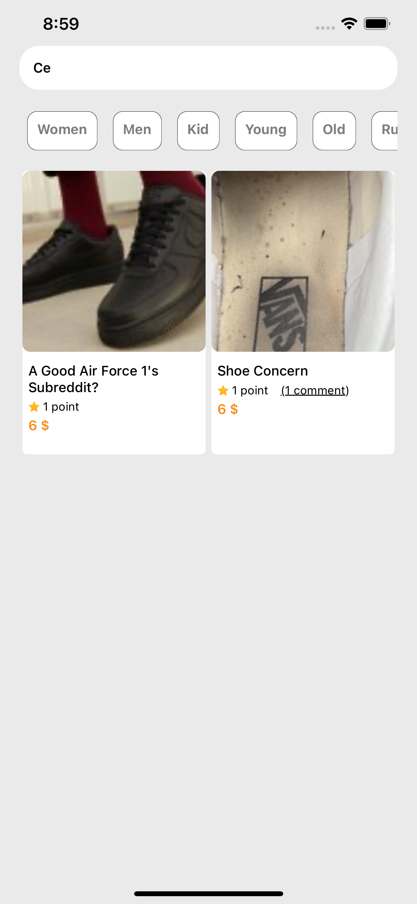
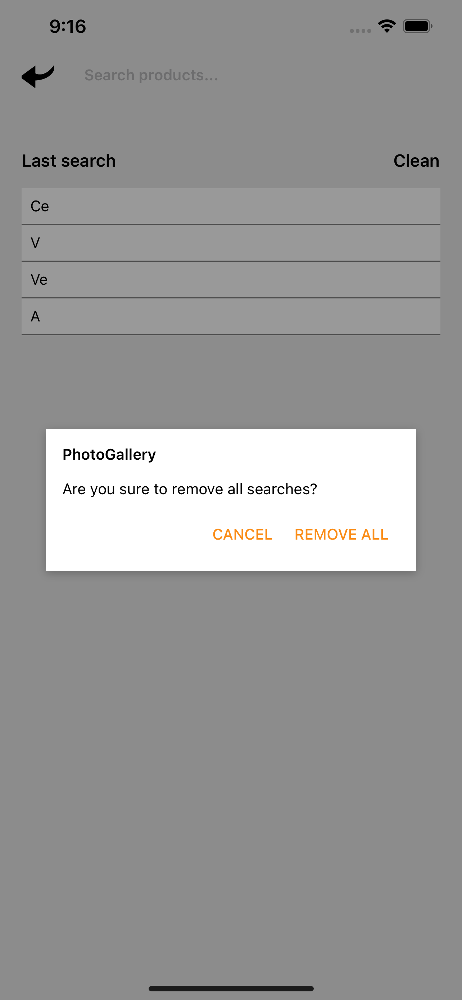
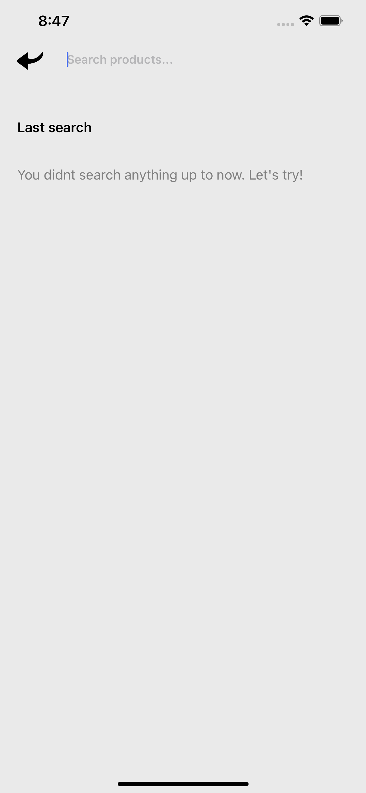

# Getting Started

First, run the development server:

- Clone the repository to your local machine.
- Install dependencies by running `npm install`.
- Run the app by running npm start and then either:
- For iOS: `npm run ios`
- For Android: `npm run android`

 

PhotoGallery app'i 2 sayfadan oluşmaktadır: `Home` ve `Detail`.

 

## Home Screen

 

Home sayfasında bir adet input alanı, categorileri gösteren bir slider (bu slider aktif değil, yalnızca butonların üstüne tıklandığında background colorları değişmektedir.) ve input alanında girilen texti içeren product-itemların listelendiği Search List bulunmaktadır.

 

- Sonuç listesi boş gelirse, kullanıcıları aşağıdaki gibi bir ekran karşılamaktadır.

 
 

- Serverda yaşanacak herhangi bir aksilikte, kullanıcıları aşağıdaki gibi bir ekran karşılamaktadır.

 
 

## Detail Screen

 

Detail sayfasında back butonu, input alanı, ürünü favorilere eklemek adına dinamik Heart iconu, ürünün görsellerinin listelendiği slider, açılıp kapatılabilen ürün açıklaması ve sepete eklemek adına pasif bir buton bulunmaktadır.

- Bu sayfada inputa tıklandığında, kullanıcının en son son arattığı kelimeler sondan başa doğru (son 5 arama) sıralanmaktadır. 

 

- Son aratılan kelimeler listesinde kullanıcı herhangi bir texte tıklandığında, Home sayfasına ilgili text araması ile yönlendirilmektedir. Ve yeniden istediği textin sonuçlarını görebilmektedir.

 

- Clean textine tıklandığı durumda ise, kullanıcılar geçmişte arattıkları tüm kelimeleri silebilmektediler veya cancel textine tıklayıp vazgeçedebilirler.

 

- Eğer kullanıcı henüz bir kelime aratmadı ise, aşağıdaki ekran karşılarına çıkacaktır.

